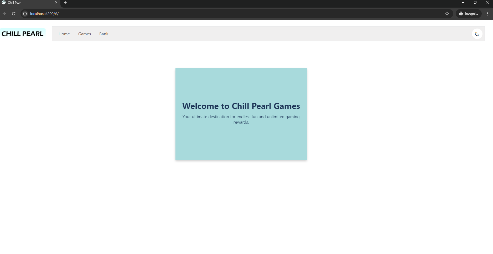
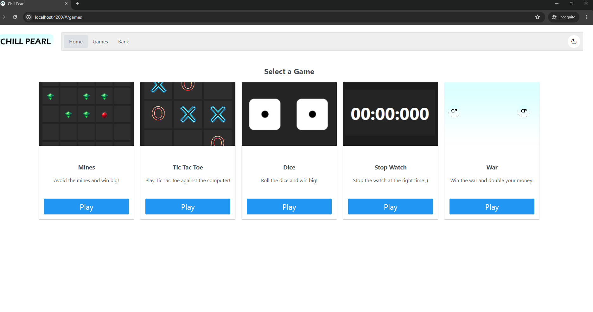

# WebGames Project

## Overview

Welcome to the WebGames Project! This project is a collection of various interactive web-based games that users can play. The games include Mines, War, Stopwatch, Tic Tac Toe, Dice, and others. Each game allows users to place bets using different currencies and win based on their performance in the game.

## Technologies Used

- **Frontend**: 
  - Angular: A TypeScript-based open-source web application framework.
  - PrimeNG: A collection of rich UI components for Angular.
  - HTML/CSS: For structuring and styling the web pages.

- **Backend**: 
  - Flask: A micro web framework written in Python.
  - Python: The programming language used to write the backend logic.
  - Flask-CORS: For handling Cross-Origin Resource Sharing (CORS), making cross-origin AJAX possible.

## Project Structure

The project is divided into two main parts: the frontend and the backend.

### Frontend

The frontend is developed using Angular and includes several main components for each game:

- **Games Components**:
  - **StopWatchComponent**: Manages the stopwatch game.
  - **MinesComponent**: Manages the mines game.
  - **WarComponent**: Manages the war game.
  - **TicTacToeComponent**: Manages the Tic Tac Toe game.
  - **DiceComponent**: Manages the dice game.

### Backend

The backend is developed using Flask and includes several routes for game logic and user balance management.

- **Routes**: Located in the `routes` folder, each file is dedicated to a specific game's API.
  - **stopwatch_routes.py**: API routes for the stopwatch game.
  - **mines_routes.py**: API routes for the mines game.
  - **war_routes.py**: API routes for the war game.
  - **tic_tac_toe_routes.py**: API routes for the Tic Tac Toe game.
  - **dice_routes.py**: API routes for the dice game.
  - **currency_routes.py**: API routes for managing currencies and user balances.

- **Game Classes**: Located in the `games` folder, each file contains the logic for a specific game.
  - **stopwatch_game.py**: Logic for the stopwatch game.
  - **mines_game.py**: Logic for the mines game.
  - **war_game.py**: Logic for the war game.
  - **tic_tac_toe_game.py**: Logic for the Tic Tac Toe game.
  - **dice_game.py**: Logic for the dice game.

- **Main Application**:
  - **app.py**: The main file to run for starting the backend server.

## How to Run the Project

### Prerequisites

- Node.js and npm: Required to run the Angular frontend.
- Python 3.x: Required to run the Flask backend.
- Flask: Python web framework.
- Flask-CORS: For handling CORS.

### Setup

1. **Clone the repository**:
    ```bash
    git clone https://github.com/AF-EL-ZUBAIDI/Web-Games.git
    cd WebGames
    ```
2. **Frontend Setup**:
   - Navigate to the frontend directory:
   ```bash
    cd frontend
   ```
   - Install dependencies:
   ```bash
    npm install
   ```
   - Run the Angular development server:
   ```bash
    ng serve
   ```
   - The frontend should now be running at `http://localhost:4200`.
  
3. **Backend Setup**:
   - Navigate to the backend directory:
   ```bash
    cd backend
   ```
   - Install dependencies:
   ```bash
    pip install -r requirements.txt
   ```
   - Run the Flask server:
   ```bash
    python app.py  # or "python3 app.py" on Mac
   ```
   - The backend should now be running at `http://localhost:5000`.
  
## Running the Project
- Make sure both the frontend and backend servers are running.
- Open your browser and navigate to `http://localhost:4200` to start playing the games.

## Screenshots

### Welcome Page
The welcome page introduces the project. Check here to find the secret message! (run the project ;))



### Games Page
The Games page displays a collection of all the games you can play. 



Discover more pages like the bank where you can manage your virtual currency. Run the project to see all features and start playing!

## License
This project is licensed under the MIT License.

---
Developed by A.F. El Zubaidi